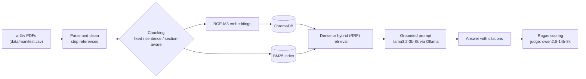

# Autonomous AI Agents: A Benchmarked RAG Research Assistant

A retrieval-augmented question-answering system over 70 arXiv papers on
autonomous AI agents, built as a small controlled experiment. The same 70
questions are run through different chunking strategies and retrieval modes,
and every answer is scored with Ragas, so design choices are compared with
numbers rather than assumed. Everything runs locally (Ollama, ChromaDB) at no
cost.

## Results

70 questions per configuration. Generator: `llama3.2-3b-8k`. Judge:
`qwen2.5-14b-8k` (a different model from the generator). Top 5 chunks retrieved.
One run per configuration.

| Configuration | Faithfulness | Context precision | Context recall | Response relevancy | Avg latency (s) |
|---|---:|---:|---:|---:|---:|
| none (no retrieval) | n/a | n/a | n/a | 0.489 | 37.9 |
| section_aware + dense | 0.808 | 0.844 | 0.900 | 0.720 | 33.7 |
| fixed_size + hybrid | 0.863 | 0.872 | 0.971 | 0.751 | 27.6 |
| sentence + hybrid | 0.870 | 0.883 | 0.986 | 0.755 | 22.4 |
| section_aware + hybrid | 0.858 | 0.880 | 0.986 | 0.782 | 26.4 |

All five configurations have 70 completed samples. The dense configuration
was rerun after an earlier attempt left one question unscored; this table uses
the complete rerun. Latency was measured while other applications were running,
so compare quality, not speed. The baseline has no retrieved context, so only
response relevancy applies to it.

What the data supports:

1. **Retrieval helps.** Response relevancy is 0.489 without retrieval and
   0.719-0.782 with it. This is the one metric defined for both, and it measures
   whether an answer addresses the question, not whether it is correct.
2. **Hybrid retrieval beat dense-only on all four metrics** (section-aware
   chunking: faithfulness +0.050, precision +0.035, recall +0.086, relevancy
   +0.063). The direction is consistent; statistical significance has not been
   tested.
3. **Chunking strategy made little difference.** The three hybrid configurations
   are within about 0.03 of each other on every metric, and no strategy wins
   across the board. With one run each, those gaps are within plausible judge
   noise.

See [Limitations](#limitations) before drawing stronger conclusions.

## Pipeline



## Method

- **Corpus.** 70 arXiv papers found with a Semantic Scholar keyword search for
  "autonomous AI agents" and downloaded from arXiv. The set is broad and not
  hand-curated, so some papers are only loosely about agents.
- **Parsing.** PyMuPDF, with dehyphenation and whitespace cleanup. Everything from
  the first References / Acknowledgements / Bibliography header onward is removed.
- **Chunking (about 400 words each, one shared budget so only the boundary
  strategy varies).** `fixed_size`: 400-word windows, 50-word overlap.
  `sentence`: whole sentences grouped up to the budget, 2-sentence overlap.
  `section_aware`: heuristic section-header detection; sections within budget stay
  whole, longer ones are sub-split with a 40-word overlap, and each chunk carries
  its section name.
- **Index.** `BAAI/bge-m3` embeddings (CPU) in ChromaDB, one collection per
  chunking strategy, plus a BM25 index (`rank_bm25`) built from the same chunks.
- **Retrieval.** Dense: Chroma nearest neighbours. Hybrid: reciprocal rank fusion
  (k=60) over the top 20 from dense and from BM25. The top 5 go to the generator.
- **Generation.** `llama3.2:3b` with an 8192-token context through Ollama,
  temperature 0.1. The prompt numbers the excerpts, requires citations, and tells
  the model to say so when the excerpts are insufficient. The baseline uses a plain
  "answer from your own knowledge" prompt and no retrieval.
- **Evaluation set.** 70 questions, each drafted by an LLM from one chunk (one per
  paper) and then reviewed manually; 1 of 70 needed editing. Questions are
  single-passage.
- **Metrics (Ragas 0.3.9).** Faithfulness, context precision (with reference),
  context recall, and response relevancy (`strictness=1`). The judge is
  `qwen2.5:14b` (8192-token context, temperature 0.1); BGE-M3 provides the
  embeddings for response relevancy.

## Repository layout

```
.
├── README.md
├── LICENSE
├── requirements.txt
├── data/
│   └── manifest.csv           # the 70-paper corpus definition (PDFs and parsed text are regenerated, not committed)
├── Modelfile_gen.txt          # llama3.2:3b with an 8192-token context
├── Modelfile_judge.txt        # qwen2.5:14b with an 8192-token context
├── src/
│   ├── ingest/                # corpus discovery, download, parsing, cleaning
│   ├── chunking/              # three chunking strategies, diagnostics
│   ├── embedding/             # BGE-M3 wrapper, Chroma index builder
│   ├── retrieval/             # dense, BM25, hybrid (RRF)
│   ├── generation/            # prompts and local Ollama client
│   └── pipeline.py            # retrieve -> prompt -> generate, plus the no-retrieval baseline
├── app/
│   ├── streamlit_app.py       # local live query and evaluation dashboard
│   ├── dashboard_only.py      # dashboard-only entry point for lightweight hosting
│   └── requirements.txt       # minimal dashboard hosting dependencies
├── eval/
│   ├── eval_set.jsonl         # 70 manually reviewed question/answer pairs
│   ├── build_eval_set.py      # LLM drafting of candidate questions
│   ├── review_eval_set.py     # manual review tool
│   ├── run_evaluation.py      # runs a configuration through the pipeline and scores it
│   ├── ragas_judge.py         # judge LLM setup
│   ├── ragas_embeddings.py    # embeddings adapter for response relevancy
│   ├── _ragas_compat.py       # shim for an upstream Ragas import bug (see docs/DEVLOG.md)
│   ├── test_ragas_smoke.py    # one-sample check that the Ragas stack works
│   └── results/               # per-question scores for each configuration
├── tests/                     # unit tests for the pure-logic components
├── docs/
│   ├── roadmap.md             # the original plan
│   ├── DEVLOG.md              # what happened, what broke, how the plan changed
│   └── STREAMLIT_GUIDE.md     # build guide for the demo and dashboard (not built yet)
└── .github/workflows/ci.yml
```

## Setup

Requires Python 3.11+ and [Ollama](https://ollama.com). Developed on Windows with
Python 3.12; all embedding and inference ran on CPU.

```bash
git clone https://github.com/Sammy-Quack/research-rag-eval.git
cd research-rag-eval
python -m venv .venv
.venv\Scripts\activate            # Windows; on macOS/Linux: source .venv/bin/activate
pip install -r requirements.txt
```

### Local models

Ollama's OpenAI-compatible endpoint is reported to ignore a client-side context
size and fall back to a default of about 4096 tokens, which is too small for the
judge's prompts. The Modelfiles in `ollama/` bake in an 8192-token context.

```bash
ollama pull llama3.2:3b
ollama pull qwen2.5:14b            # only needed to run the evaluation (about 9 GB)
ollama create llama3.2-3b-8k -f Modelfile_gen.txt
ollama create qwen2.5-14b-8k -f Modelfile_judge.txt
```

### Build the data

The first run downloads BGE-M3 (several GB of model files). Create the two local
Ollama models from the Modelfiles in the repository root:

```bash
python -m src.ingest.run_ingestion        # download and parse the 70 papers in data/manifest.csv
python -m src.chunking.run_chunking
python -m src.embedding.build_index --strategy section_aware --embedder bge_m3
python -m src.embedding.build_index --strategy sentence --embedder bge_m3
python -m src.embedding.build_index --strategy fixed_size --embedder bge_m3
```

### Ask a question

```bash
python -m src.pipeline --strategy section_aware --mode hybrid --query "How are autonomous agents evaluated on benchmark tasks?"
python -m src.pipeline --mode none --query "How are autonomous agents evaluated on benchmark tasks?"   # no-retrieval baseline
```

Expect roughly 20-40 seconds per answer on a CPU-only laptop.

### Streamlit demo and dashboard

With the Ollama models, corpus, and indexes set up, run the full local app:

```powershell
streamlit run app/streamlit_app.py
```

The **Ask a question** tab uses the live Ollama pipeline. The **Evaluation
dashboard** tab reads the saved result JSONs, reports, and graphs from
`eval/results/`; it does not need Ollama. For a dashboard-only deployment, use
`app/dashboard_only.py` with the lightweight `app/requirements.txt`.

### Reproduce the evaluation

`--limit` defaults to 5, so pass a number of at least 70 for a full run. Progress
is saved after every question and a re-run resumes where it stopped. Each
configuration takes roughly 30-45 minutes on a CPU-only laptop.

```bash
python -m eval.run_evaluation --strategy section_aware --mode hybrid --limit 100
python -m eval.run_evaluation --strategy section_aware --mode dense  --limit 100
python -m eval.run_evaluation --strategy fixed_size    --mode hybrid --limit 100
python -m eval.run_evaluation --strategy sentence      --mode hybrid --limit 100
python -m eval.run_evaluation --mode none --limit 100
```

Final results are the files in `eval/results/` ending in `__llama3_2_3b_8k.json`.
Only completed results from the final `llama3.2-3b-8k` generator are kept in
`eval/results/`; superseded Groq and same-model generator/judge outputs have
been removed. Per-configuration reports and graphs are stored in sibling
`*_analysis/` directories. To regenerate a report:

```bash
python eval/results/rag_eval_analyzer.py eval/results/section_aware__hybrid__llama3_2_3b_8k.json
```

### Tests

```bash
pytest tests/ -v                   # no Ollama needed
```

### Optional keys

Not needed to reproduce the results, because `data/manifest.csv` and
`eval/eval_set.jsonl` are committed:

- `SEMANTIC_SCHOLAR_API_KEY`: only for re-running corpus discovery
  (`src/ingest/fetch_corpus.py`). Search results change over time, so a re-run can
  produce a different corpus.

The evaluation-set drafting script also runs locally through Ollama and uses
`qwen2.5-14b-8k`; the already reviewed `eval/eval_set.jsonl` is committed, so
this model is needed only when drafting a replacement set.

## Limitations

The full list, with evidence, is in [`docs/DEVLOG.md`](docs/DEVLOG.md#6-limitations-to-keep-in-mind-when-reading-the-results).
The ones that matter most:

- **One run per configuration and no confidence intervals.** The judge is an LLM.
  Differences of a few hundredths should not be read as real.
- **The eval set was drafted from section-aware chunks**, which could favour that
  strategy, and it contains only single-passage questions.
- **Reference answers are LLM-drafted and reviewed by one person.**
- **The judge is a local 14B model** scoring a 3B generator. Absolute scores are
  not comparable to results obtained with stronger judges.
- **`response_relevancy` uses `strictness=1`** instead of the recommended 3-5, a
  holdover from an earlier API constraint, kept fixed across all configurations.
- **The baseline comparison rests on one metric**, which measures topical
  relevance, not correctness.
- **The corpus is a keyword-search sample**, broader than a curated set.
- **Latency was measured under background load.**
- **Several explanations in the dev log are hypotheses** that have not been
  tested (listed in its Section 5).

## Status

Done: ingestion, chunking (3 strategies), indexing, dense / BM25 / hybrid
retrieval, grounded generation, the evaluation set, the Ragas evaluation of five
configurations, unit tests and CI.

Built: the local Streamlit query demo and results dashboard (implementation
guide in [`docs/STREAMLIT_GUIDE.md`](docs/STREAMLIT_GUIDE.md)).

Not attempted: reranking, a second embedding model, multi-passage questions, a
fine-tuning comparison.

## Data and licensing

Paper PDFs and parsed text are not committed; `data/manifest.csv` lists the arXiv
IDs they come from. `eval/eval_set.jsonl` stores, for provenance, the source chunk
each question was drafted from, attributed by arXiv ID. Copyright in those
excerpts remains with the original authors. The code is released under the MIT
license (see `LICENSE`).
